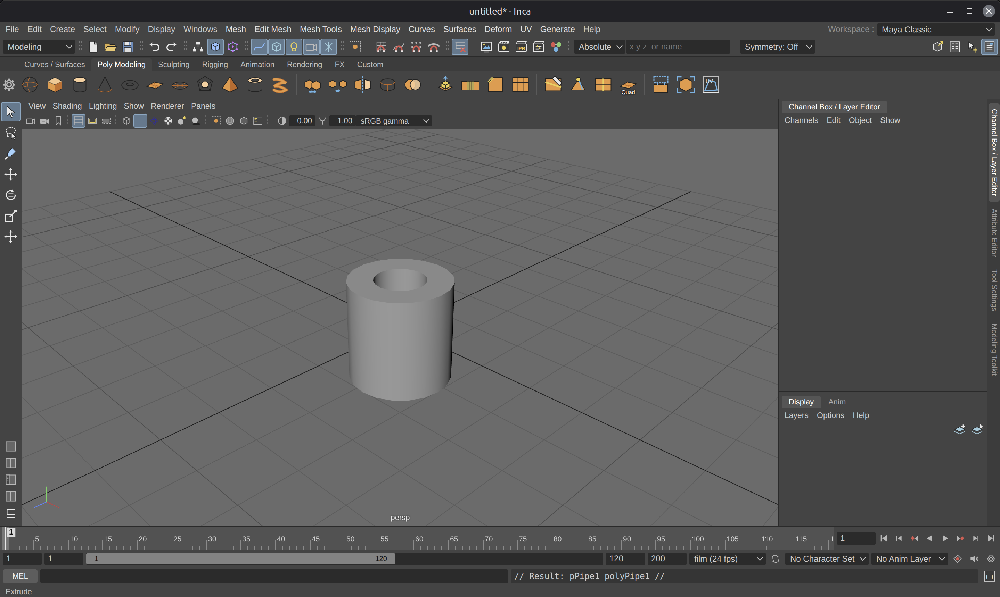

# Inca

A free, open-source 3D modeling, animation and rendering application for the desktop

## Contributing

Write an issue on the gh issues page




See [FEATURES.md](FEATURES.md) for the full feature list.

## Download and run

Go to the [Releases page](https://github.com/v3ai/inca/releases) and open the newest release. Under **Assets**, download the file for your computer.

### Windows
1. Download **`Inca-<version>-win-x64-portable.exe`**.
2. Double-click it. You don't need to install anything.
3. If Windows shows "Windows protected your PC", click **More info**, then **Run anyway**. Windows shows this for apps from small developers. It doesn't mean anything is wrong.

You can also download the **`.zip`** instead. Unzip it, then double-click **`Inca.exe`** inside the folder.

### Linux
1. Download **`Inca-<version>-linux-x86_64.AppImage`**.
2. Right-click the file, open **Properties → Permissions**, and tick **Allow executing file as program**.
   In a terminal you can do the same with `chmod +x Inca-*.AppImage`.
3. Double-click it to start Inca.

If it doesn't open, start it from a terminal so you can see the error:
```
./Inca-*.AppImage --no-sandbox
```
On Ubuntu 22.04 or newer, if you get an error about **FUSE**, run `sudo apt install libfuse2` once. On Ubuntu 24.04 the package is called `libfuse2t64`.

### macOS
There's no ready-made Mac download yet. Follow **Run from source** below. It takes about five minutes.

## Run from source

### 1. Install Node.js (version 18 or newer)
Ubuntu / Linux Mint: `sudo apt install nodejs npm` is enough. (If `apt update` complains about one broken
third-party repository, such as an old `apt.kitware.com` entry, that only affects that repository; you can
disable it in Software Sources.)

Inca runs on [Electron](https://www.electronjs.org/), which is installed through npm, so you need a
recent Node.js. Check with `node -v`.

- **Linux Mint / Ubuntu / Debian:** the distro's `nodejs` package is often too old. Use NodeSource or nvm:
  ```
  curl -fsSL https://deb.nodesource.com/setup_22.x | sudo -E bash -
  sudo apt-get install -y nodejs
  ```
  or `curl -o- https://raw.githubusercontent.com/nvm-sh/nvm/v0.40.1/install.sh | bash`, open a new terminal, then `nvm install 22`.
- **Windows / macOS:** install the LTS version from https://nodejs.org.

### 2. Install the dependencies (this also installs Electron)
In a terminal, inside the `inca` folder (the one containing `package.json`):
```
npm install
```
This downloads Electron, three.js and the other libraries into `node_modules/`, then copies the
three.js add-ons into `vendor/three-addons/` (the app also recreates that folder on start-up if it is missing).

If Electron did not get installed (for example `npm start` says `electron: not found`), install it explicitly:
```
npm install --save-dev electron@38.8.6
```
If its download was blocked or interrupted, delete `node_modules/electron` and run the command again.

### 3. Start Inca
```
npm start
```
**Linux:** if Electron exits with an error about `chrome-sandbox` / "SUID sandbox helper", either fix the
helper's permissions once:
```
sudo chown root node_modules/electron/dist/chrome-sandbox && sudo chmod 4755 node_modules/electron/dist/chrome-sandbox
```
or start without the sandbox: `npm start -- --no-sandbox`.

### Blank window?
If the window opens but stays empty or shows "Inca could not start", the libraries are incomplete.
Run `npm install` again in the `inca` folder, then `npm start`. Ctrl+Shift+F12 opens the developer
tools, where the Console tab shows the exact file that failed to load.

## Build installers
Works with Node.js 18 or newer (including Ubuntu / Linux Mint's own `nodejs` 18.19 package).
If you get `ERR_REQUIRE_ESM ... @noble/hashes/blake2.js`, your `node_modules` still has a newer
electron-builder from an older copy of Inca: run `rm -rf node_modules package-lock.json && npm install`.
```
npm run dist:linux          # dist/Inca-<ver>-linux-x86_64.AppImage
npm run dist:win            # dist/Inca-<ver>-win-x64.zip (unzip on Windows, run Inca.exe)
npm run dist:win-portable   # dist/Inca-<ver>-win-x64-portable.exe (single file, just double-click)
npm run dist:win-installer  # NSIS setup .exe - build this on Windows, or on Linux with Wine installed
npm run dist:mac            # run on macOS
```
Each build runs on its own, so `npm run dist:linux && npm run dist:win` builds both.

## Tests
```
npm test                                   # geometry kernel + editor maths
INCA_TEST=script.js INCA_SHOTS=out npx electron .   # drive the real app with a script and capture screenshots
```

## Layout
- `main.js`, `preload.js` — Electron main process & native bridge (files, dialogs, prefs)
- `src/js/core` — engine: scene graph & construction history (`scene.js`), polygon kernel (`polymesh.js`, `ops.js`),
  primitives, curves, materials, animation, undo, MEL interpreter, file I/O, rigging, deformers, constraints, dynamics, booleans
- `src/js/ui` — interface: viewports, menus, shelves, panels, editors and tools
- `docs/ui-contract.md` — how UI modules plug into the app

MIT licensed. Built with three.js, three-mesh-bvh, three-gpu-pathtracer, three-bvh-csg and Electron.
